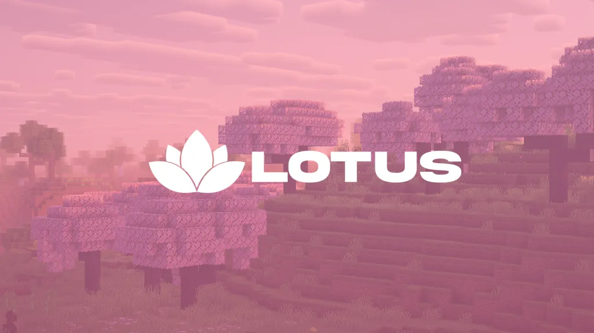

  

<h1 align="center">Lotus RBW</h1>

Competitive Ranked Bedwars on <b>The Hive</b>
 
Focused on keeping the scene competitive while making sure <b>newgens are welcome</b>.

  

---

## About

I'm the owner of **Lotus RBW**, a competitive Ranked Bedwars community built around improving the scene and giving newer players a place to get involved.

A lot of competitive communities end up becoming closed circles over time.  
Lotus is focused on keeping things **competitive while still welcoming new players into the scene**.

## Goals

- Keep Ranked Bedwars competitive
- Make it easier for **newgens to get involved**
- Maintain fair systems and moderation
- Build a long-term competitive community

## Community

If you're interested in Ranked Bedwars or competitive Hive gameplay, feel free to join.

**Discord:**  
https://discord.gg/hivebw

---

Lotus RBW 🌸
 
Competitive. Fair. Open to new players.

